Routing Overlay Network for PCs with the Same IP Addresses - Overlay Router
===========================================================================

This document describes a network with a Overlay router and an overlay network that allows PCs with the same IP address to connect to the control PC. This is achieved through the use of namespaces and virtual ethernet adapters that patch one namespace to another.

Network Diagram
===============
The network diagram is shown below:

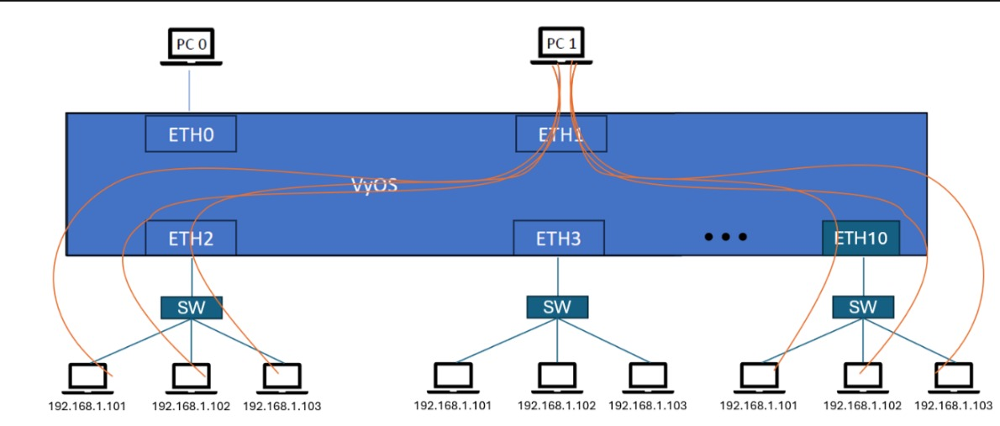

The network consists of the following devices:

* PCs: These are the computers that connect to the network.
* Overlay Router: This is a software router that runs on the Overlay router and creates the overlay network. 
  
Network Configuration
=====================
The network is configured as follows:

* The PCs are configured with IP addresses in the 192.168.1.0/24 subnet.
* The Overlay router is configured with the following interfaces:
   * eth0(192.168.2.35/22): This interface connects to the Management PC0 - 192.168.2.222/22.
   * eth1(10.0.0.1/24): This interface connects to the Controller PC1 - 10.0.0.1/24.
   * eth2(192.168.1.1/24): This interface connects to a switch that connects to group 1 of PC's with IP address in 192.168.1.0/24 network space.
   * eth3(192.168.1.1/24): This interface connects to a switch that connects to group 2 of PC's with IP address in 192.168.1.0/24 network space.

* The overlay router is configured with namespaces and vitual ethernet to connect the namespaces to create an overlay network on top of the Alpine router's physical network.

NameSpaces and Virtual Ethernet Adapters
========================================
Namespaces and virtual ethernet adapters are used to create the overlay network. Namespaces provide a way to isolate processes and resources on a Linux system. Virtual ethernet adapters provide a way to connect namespaces to each other.

Lab Documentation: Virtual Router with Overlay Networks and DNAT
================================================================
This document describes a network lab setup with three PCs (PC1, PC2, PC3), a virtual router (alpinelinux), and virtual networks using namespaces and veth interfaces. 
The lab demonstrates routing, connectivity, and DNAT functionalities.

Hardware and Software:

* VirtualBox
* Alpine Linux x86_64 virtual images
* Host-only network adapters
* Bridge adpater

Lab Setup:

1. Download the virtual box for flavour of the operating system
   https://www.virtualbox.org/wiki/Downloads

2. Install the virtualbox in accordance to your operating system by following the installation guide
   https://www.wikihow.com/Install-VirtualBox#:~:text=1%20Open%20Terminal.%20%20...%20Terminal%20from%20the,minutes.%20When%20you%20see%20your%20computer...%20More%20   

3. Download the alpine_linux_x86_64 virtual image 
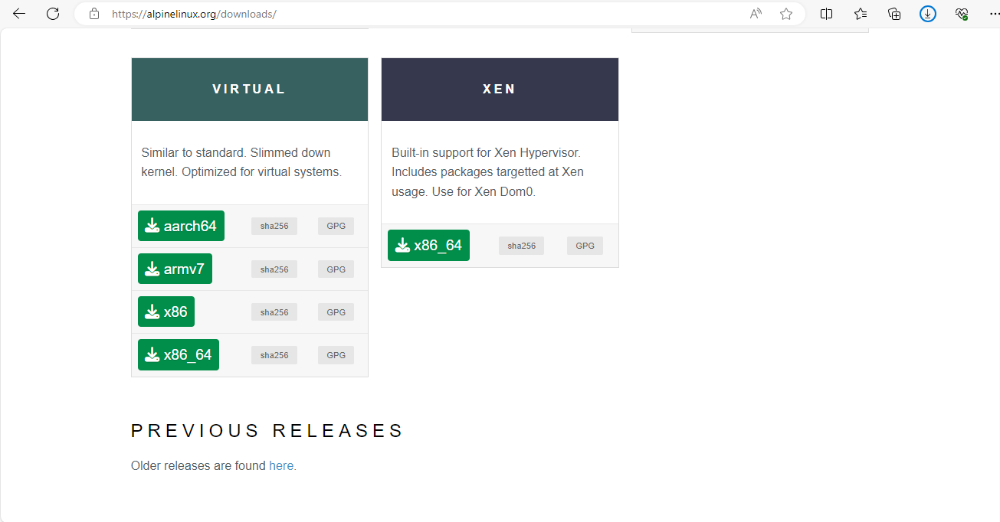

4. Setting Up PCs on virtualbox:
   Install Alpine x86_64 on virtualbox as PC1, PC2, and PC3.
   * clieck on the New button
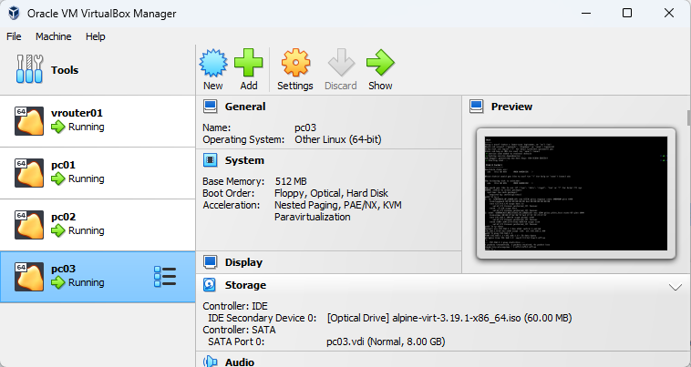

  * Enter the name for PC1, PC2, PC3 and Vrouter respectively for each time while repeating the steps
  * Navigate the path the downloaded alpine image
  * Choose Linux as its type, Linux 64-bit as its version
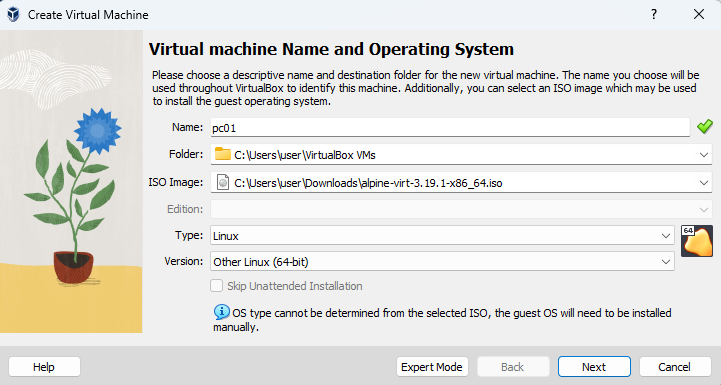

  * Click Next and leave it to default
.. image:: images/install_alpine_step3.png
  :alt: Step3

  * Click Next and leave it to default
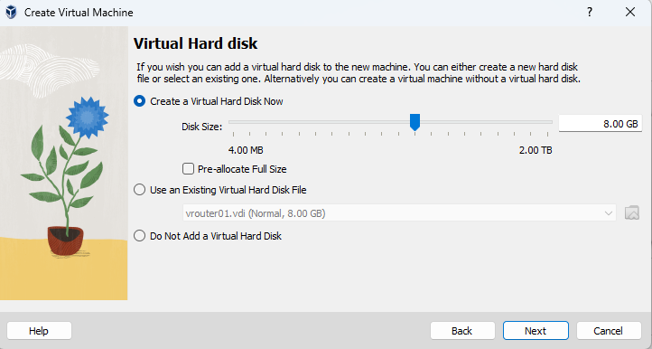
  * Click on Finish button

      * Note before starting the pc setup the network adapters accordingly by navigating to settings
  * Click on setting button

  * Navigate to the network tab on side bar
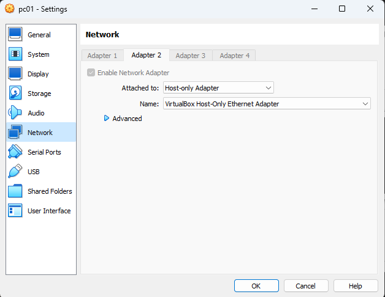
  * Set the network adapter for PC's accordingly
     * For PC1

     * For PC2
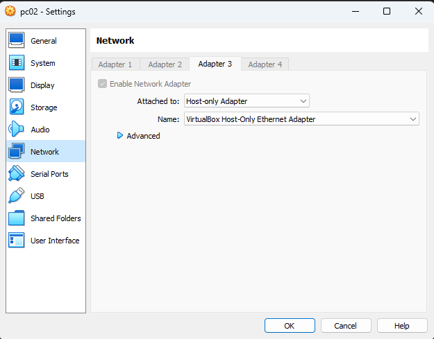
     * For PC1

     * For Vrouter - Set the 4 virtual adapters as follows:
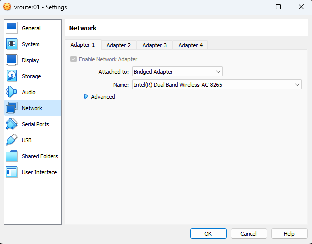

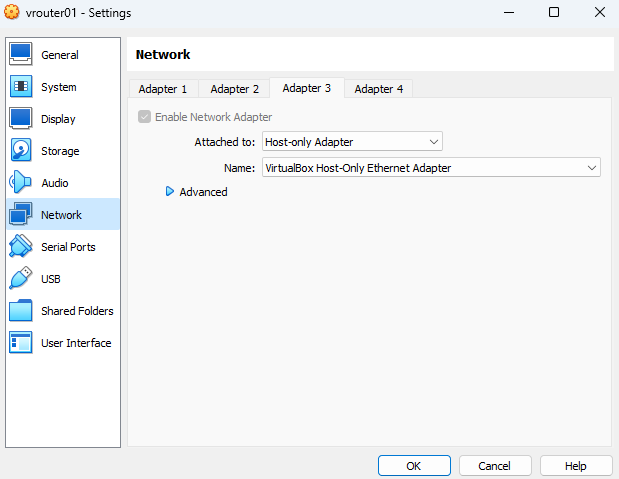
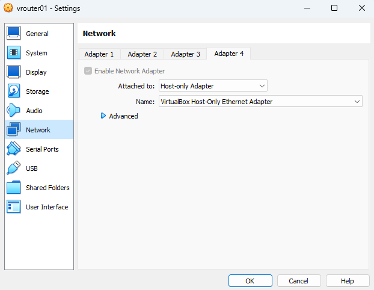

  * Start the PC's and Vrouter, by clicking the start button, this will open the terminal.
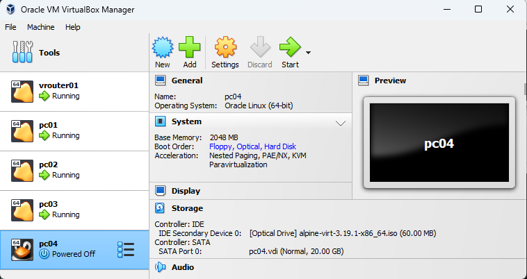

  * Login to alpine with default username 'root' and password as ''

  * Type 'setup-alpine' and enter the interactive setup
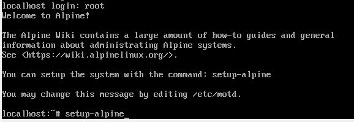

   * The setup-alpine script offers the following configuration options:
      * Keyboard Layout : 'us'
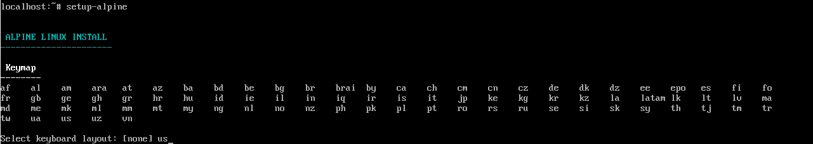
      * Keyboard Variant : 'us'
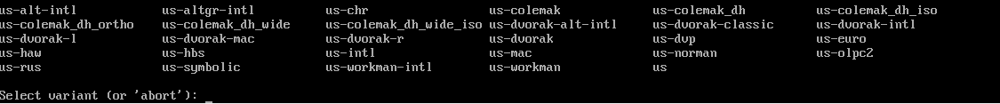
      * Hostname: 'PC01' or 'PC02' or 'PC03' or 'vrouter'

      * Network: 'none'
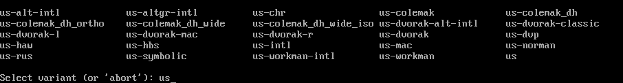
      * DNS Servers:'8.8.8.8'
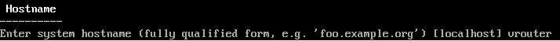
      * Root password: 'set root password of your choice'
.. image:: images/install_alpine_step17.png
  :alt: Step19
      * Timezone: 'Asia/Singapore'
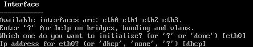
      * HTTP/FTP Proxy (Proxy server to use for accessing the web/ftp. Use "none" for direct connections to websites and FTP servers.)
      * Mirror (From where to download packages. Choose the organization you trust giving your usage patterns to.)
      * Setup a user (Setting up a regular user account)
      * SSH (Secure SHell remote access server. "OpenSSH" is part of the default install image. Use "none" to disable remote login, e.g. on laptops.)
      * Disk Mode (Select between diskless (disk="none"), "data" or "sys", as described above.)
  

1. Enable virtual ethernet adapters 2, 3, and 4 on each PC and set them as host-only adapters